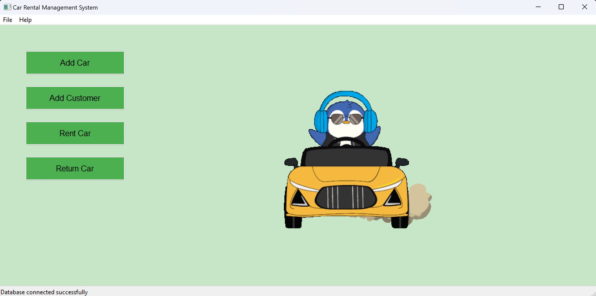
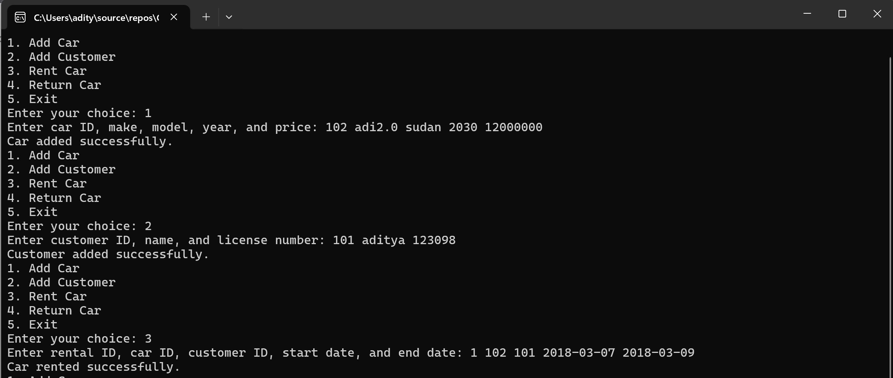
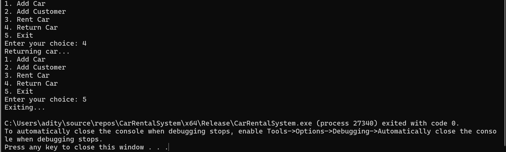

# 🚗 Car Rental Management System (CarGoPlus)

 

## 📋 Table of Contents
- [About the Project](#about-the-project)
- [Features](#features)
- [Screenshots](#screenshots)
- [Installation](#installation)
- [Usage](#usage)
- [Contributing](#contributing)
- [License](#license)
- [Contact](#contact)

## 📖 About the Project
The **Car Rental Management System** is a user-friendly application designed to manage car rentals efficiently. It features a graphical user interface built using wxWidgets and integrates with a MySQL database.

## ✨ Folder Structure :-
 ```plaintext
    📁 CarGoPlus/
├── 📁 MySQL/
│   ├── 📁 tables/
│   │   ├── 📄 cars.ibd
│   │   ├── 📄 customers.ibd
│   │   └── 📄 rentals.ibd
│   └── 📄 Schema.sql
├── 📁 Screenshots/
│   ├── 🖼️ 1.jpg
│   ├── 🖼️ 2.jpg
│   └── 🖼️ 3.jpg
├── 📁 include/
│   ├── 📄 car.h
│   ├── 📄 customer.h
│   ├── 📄 database.h
│   └── 📄 rental.h
├── 📁 src/
│   ├── 📁 core/
│   │   ├── 📄 car.cpp
│   │   ├── 📄 customer.cpp
│   │   ├── 📄 database.cpp
│   │   └── 📄 rental.cpp
│   └── 📁 ui/
│       └── 📄 main.cpp
├── 📄 .gitattributes
├── 📄 .gitignore
├── 📄 CarRentalSystem.sln
├── 📄 LICENSE.txt
└── 📄 README.md
```
## ✨ Features
- 📊 Manage car inventory
- 👤 Handle customer data
- 📝 Track rental transactions
- 📅 View rental history
- 📸 GUI for ease of use

## 🖼️ Screenshots
1. **Main Screen**  
   
2. **Car Inventory**  
   
3. **Rental Transactions**  
   

## 🛠️ Installation
### Prerequisites
- MySQL
- wxWidgets
- C++ Compiler

### Steps
1. **Clone the repository**
    ```sh
    git clone https://github.com/aditya26062003/CarRentalSystem.git
    ```
2. **Navigate to the project directory**
    ```sh
    cd CarRentalSystem
    ```
3. **Set up the database**
    ```sh
    mysql -u username -p < MySQL/Schema.sql
    ```
4. **Build the project**
    - Open `CarRentalSystem.sln` in Visual Studio
    - Build the solution

## 🚀 Usage
1. Run the executable generated from the build process.
2. Use the GUI to navigate through the application features.
3. Manage cars, customers, and rentals effortlessly.

## 🤝 Contributing
Contributions are what make the open-source community such an amazing place to be, learn, and create. Any contributions you make are **greatly appreciated**.

1. Fork the Project
2. Create your Feature Branch (`git checkout -b feature/AmazingFeature`)
3. Commit your Changes (`git commit -m 'Add some AmazingFeature'`)
4. Push to the Branch (`git push origin feature/AmazingFeature`)
5. Open a Pull Request

## 📜 License
Distributed under the MIT License. See `LICENSE.txt` for more information.

